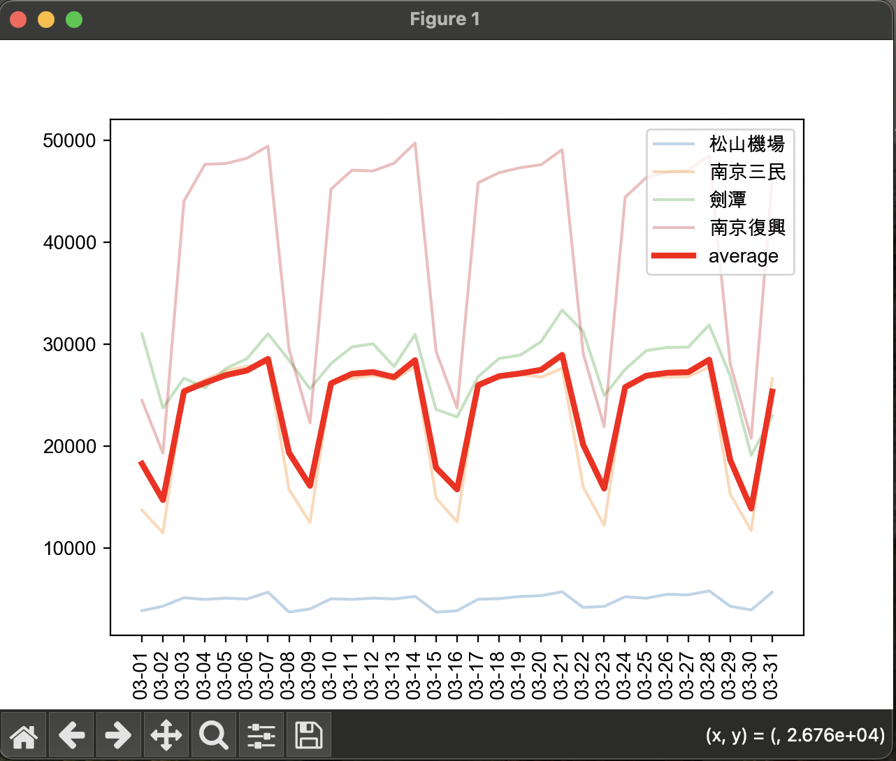
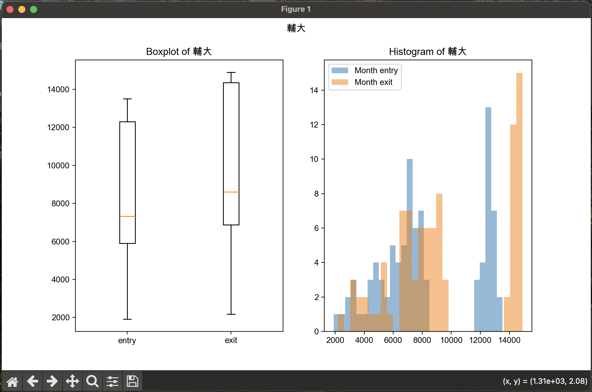
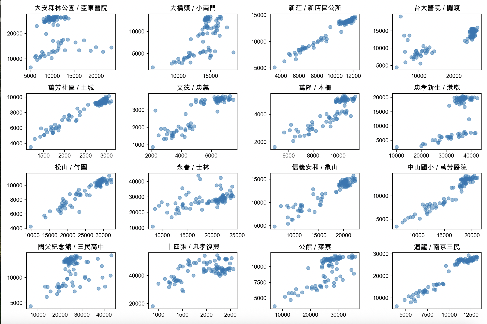

# For the charts drawn in sub-questions (a), (b), and (c), discuss whether there are any issues in the data based on the visualizations

## sub-question (a)

In the chart for sub-question (a), we can observe that each station has a very similar shape in terms of the number of rides throughout the month. Thus, we can easily infer that the shape of the data are reflected from time and its quantity are influenced by what station it is (its location).

## sub-question (b)

in the boxchart, we can discover that its exit status are sinifiacntly higher than its entry status.
On the other hand, the histogram of the same place also shows the same trend. Which lead us to the conclusion that this station is more likely to be used as an exit station rather than an entry station. (That it's reasonable because it's a Collage station)

## sub-question (c)

According to the conclusion of #sub-question (a) that "the shape of the data are reflected from time and its quantity are influenced by what station it is (its location)", figure c erflect this conclusion by most of the point in the scatter plot are concentrated in the line of x=y, which means that the entry and exit data are positively correlated.